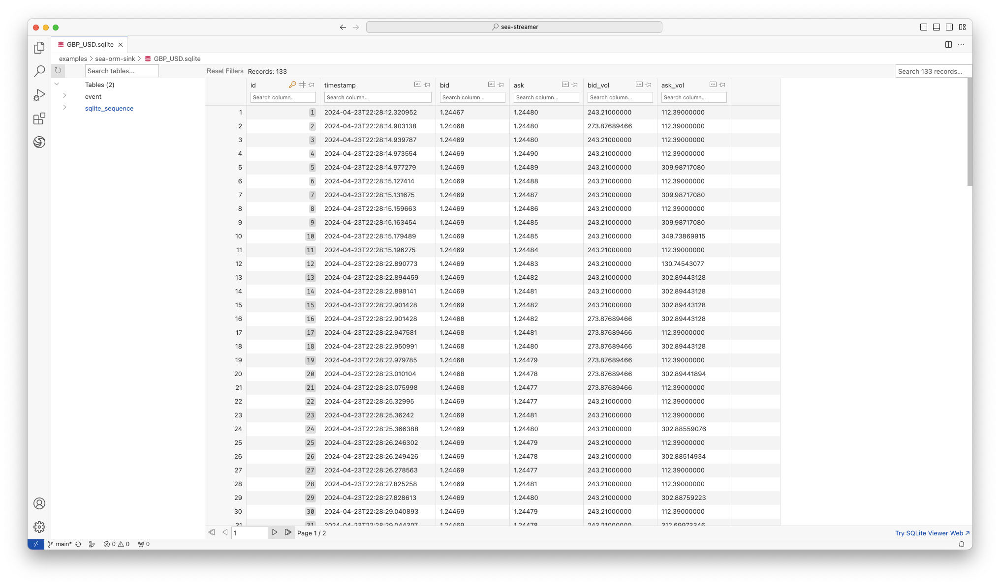

# SeaORM Data Sink

This example demonstrates how to consume a stream from Redis / Kafka and store the data to MySQL / Postgres / SQLite / SQL Server.

It will create the table automatically. You have to run the `price-feed` example first. It will subscribe to `GBP_USD` and saves to `GBP_USD.sqlite` by default. Incoming JSON messages will be deserialized and inserted into database.

```sh
RUST_LOG=info cargo run
```

A more complex example with buffering and periodic flush can be found at https://github.com/SeaQL/FireDBG.for.Rust/blob/main/indexer/src/main.rs

